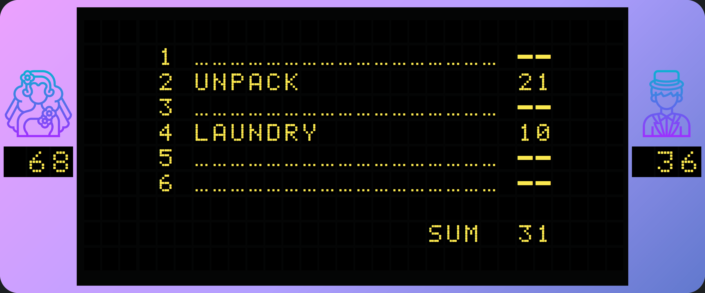
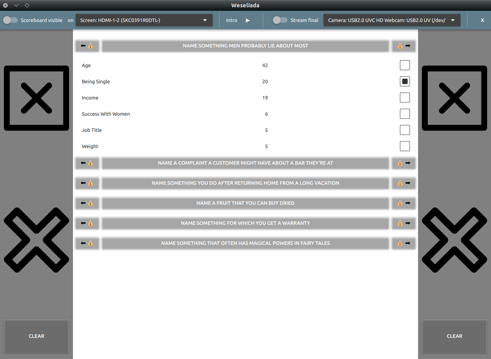

# Weseliada

Weseliada is a simple Qt Quick application for a wedding game based on [Familiada](https://en.wikipedia.org/wiki/Familiada) - Polish version of the TV show "Family feud". By
 default, the two sides competing in *Weseliada* are Bride and Groom but this
 can be easily modified to fit any other celebration or even a regular party.

The score board, visible to all participants and the audience looks like this:




The game panel which is only accessible to the game master and contains controls and the list of questions with answers looks as follows:



## Rules

Weseliada rules are very similar to the original TV show rules. In fact, the first round has only two differences:

1. There is no point doubling or tripling while the game progresses.
1. The first round does not necessarily end when one team earns 300 points. It can go on until there are no more questions.

The second (final) round is intended to be some kind of a "real-life" challenge for team captains (or two members of the team that won the first round), so the only thing
 implemented in the app is displaying a camera stream in the
 main window and the rest is up to your creativity. You could play the second round as in the TV show if you wish.

## Usage Instructions

### Build

The game has been developed and tested on Ubuntu 18.04 with Qt 5.15 and gcc 10. CMake 3.14+ is also required. I do not plan to provide pre-build binaries for any platform. Below
 is a short instruction on how to build from sources:
 
 1. Clone the repo from GitHub or download a zip package with a snapshot of the repo.
 1. Make sure you have all the dependencies listed above installed on your system.
 1. Navigate to the root directory of your local clone of the repo.
 1. Choose a build directory name, e.g. `build` and tell CMake to configure the project in this directory, for example:
    ```bash
     cmake 
        -B build/
        -G"Unix Makefiles"
        -DCMAKE_BUILD_TYPE=Release 
        -DCMAKE_CXX_COMPILER=/usr/bin/g++-10 
        -DQt5_ROOT=/path/to/Qt/5.15.0/gcc_64/ 
    ```
 1. Navigate to the build directory and compile the project
    ```console
    me@computer:~$ cd build
    me@computer:~$ make 
    ``` 
  1. Run the game with `./Weseliada`

### Game Questions
  
The game is only as interesting as the questions that both teams need to answer. The app loads a list of questions from a json file `resources/data/questions.json` at startup
. Simply modify this file preserving the format to put your own questions in the game.  
  
### Polish translation

By default, the text in the game (on the scoreboard and in the game master window) is in English. Polish translation is provided and can be enabled by uncommenting lines
```cpp
//    QTranslator translator;
//    const QString polishTranslation = "Weseliada_pl_PL";
//    translator.load(polishTranslation);
//    app.installTranslator(&translator);
```
in `main.cpp`. Questions are not automatically translated, they will be copied from `resources/data/questions.json` verbatim.
     
## Attributions

* Groom and Bride icons made by [Eucalyp](https://www.flaticon.com/authors/eucalyp) from www.flaticon.com
* ecran monochrome font by DaStargate from https://www.dafont.com/ecran-monochrome.font
* LED Calculator font by Colonel Sanders from https://www.dafont.com/led-calculator.font
* sample questions taken from https://www.familyfeudquestions.com